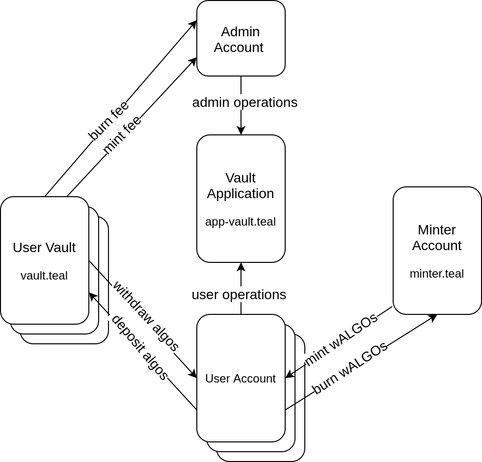

# StakerDAO Vault

## Test Instructions

```bash
git clone git@github.com:randlabs/stakerdao-vault.git
cd stakerdao-vault
npm install
npm test
```

## Command Line Tool

Get the command line options:
```bash
node vault-cli.js to 
```

Command Line usage example:
```bash
./test-cli.sh
```

## Vault

Accounts can create a Vault and store their algos there and receive participation rewards for them. Users can mint wALGOs up to the balance of algos they keep in 
the Vault and withdraw them at any time keeping algo balance above or equal to the amount of wALGOs minted.
Vault creation can cost a fixed amount in algos which must be paid in optIn operation.
Mint and Burn operations can require to pay a percent of the amount minting and burning.

### Global Variables

* A Byte[] (Admin): admin of the Application
* GS Int (GlobalStatus): 1 if the Application is enabled and 0 if it is not
* MA Byte[] (MintAccount): account storing the wALGOs. This account must give access to the Application to send the wALGOs to the Vault owner accounts
* MF Int (MintFee): fee paid in ALGOs for each mintwALGOs operation
* BF Int (BurnFee): fee paid in ALGOs on each burnwALGO operation
* CF Int (CreationFee): fee paid in ALGOs on each burnwALGO operation
* ASA Int (ASA ID): id of wALGO token
* VP Byte[] (Vault Prefix): first part of the vault.teal program. In the middle is placed the user account address.
* VS Byte[] (Vault Suffix): last part of the vault.teal program. In the middle is placed the user account address.

### Local Account Variables

* s (status): 1 if the Vault is enabled and 0 if it is not
* m (minted): net amount of wALGOs minted
* v (vault): Vault account corresponding to Vault owner account. This address is calculated from vault.teal specialized with the Vault owner account

Remarks:
* Only 1 Vault per account is allowed
* Minimum Withdrawal: 1000 micro Algos
* Mint & Burn Fee: if it is changed, only future mint operations are impacted
* Attackers can prevent an account to open a Vault if they know the account address on advance. Users should not reveal publicly their accounts that they are going to use to open a Vault.
* ClearState: calling clearState generate a permanent lost of the algos deposited in the Vault.

## Components



NOTE: users can mintwALGOs and withdrawALGOs to any account, and burnwALGO and depositALGOs from any account. In the same way, the fees can be paid from any
acount. This diagram shows the general logic but for simplicity it does not show all the valid possibilities.

### Minter Account

The Minter account is used to mint and burn wALGOs. This account acts like wALGO hot wallet. It signs a logic sig delegation code generated from minter.teal.tmpl replacing TMPL_APP_ID with the application id. It allows user accounts to mint wALGOs up to the amount of algos they keep in the Vault.

### User Vault

Each vault generates its own vault.teal replacing from vault.teal.tmpl TMPL_USER_ADDRESS with its account address and TMPL_APP_ID with the application id.
For each account opted in, there is a unique Vault address where users deposits their algos that back wALGOs up.

## Vault Application

This application is implemented in app-vault.teal. It handles all the Vault operations including those executed by the admin and the users. 
It verifies that user accounts interacting with it are using a Vault that is managed by vault.teal. To do this, initializeApp sets the Prefix and Suffix of the 
vault.teal code, then the vault.teal is recontructed in the app-vault.teal in this way:
vault.teal: "Program" + Prefix + USER_ADDRESS + Suffix

When users optin, they send the Vault address and app-vault.teal computes the vault.teal replacing USER_ADDRESS with the real user address and calculates the 
Vault address that corresponds to the user. If the user specifies a Vault address that does not match with this calculation, the transaction
is rejected and the user cannot optIn.

This application handles all transactions interacting with the Vaults. The vault.teal requires that any transaction withdrawing algos from it has to include a 
tx0 in a transaction group that is an application call to this application. In this way, all the transaction group is controlled by this application to ensure
that the general logic is always preserved.

### Admin Account

Vault Application has an admin account that can initialize the application, disable the application, disable individual accounts, change the fees, change the minting account, update the application, and delete it.

### User Account

Each user creating a Vault must have a controlling wallet that is used to execute all Vault operations. Vault Application uses this account to authenticate user operations.

## Operations

### Admin updateApp

The admin can update the teal code of the application.

* Tx0: 
  * Sender: Admin
  * OnCompletion: UpdateApplication
  * Application Call tx

### Admin deleteApplication

The admin can delete the application. 

* Tx0: 
  * Sender: Admin
  * OnCompletion: DeleteApplication
  * Application Call tx

### Admin initializeApp

The admin can update the teal code of the application.

* Tx0: 
  * Sender: Admin
  * OnCompletion: UpdateApplication
  * arg0: str:iA
  * arg1: integer:ID of ASA wALGO
  * arg2: str:Vault code Prefix
  * arg3: str:Vault code Suffix
  * Application Call tx

### Admin setGlobalStatus

The admin can enable or disable any vault at any time.

* Tx0: 
  * Sender: Admin
  * OnCompletion: NoOp
  * arg0: str:sGS
  * arg0: integer: new status (0 or 1)
  * Application Call tx

### Admin setAccountStatus

The Admin can enable or disable any vault at any time.

* Tx0: 
  * Sender: Admin
  * OnCompletion: NoOp
  * arg0: str:sAS
  * acc0: User Address
  * arg0: integer: new status (0 or 1)
  * Application Call tx

### Admin setMinterAccount

The Admin can change the Minter account. This account is used to mint wALGOs in mintwALGOs operations. By default, the Minter == Creator.

* Tx0: 
  * Sender: Admin
  * OnCompletion: NoOp
  * arg0: str:sMA
  * acc0: new Minter Address
  * Application Call tx

### Admin setAdminAccount

The Admin can change the Admin account. This account is used to execute all Admin operations.

* Tx0: 
  * Sender: Admin
  * OnCompletion: NoOp
  * arg0: str:sAA
  * acc0: new Admin Address
  * Application Call tx

### Admin setMintFee

Set the percent of paid in ALGOs on each mintwALGOs operation

* Tx0: 
  * Sender: Admin
  * OnCompletion: NoOp
  * arg0: str:sMF
  * arg1: integer: new fee (0 to 5000 which means 0%-50%)
  * Application Call tx

### Admin setBurnFee

Set the percent of ALGOs reserved for the Admin on each burnwALGOs operation

* Tx0: 
  * Sender: Admin
  * OnCompletion: NoOp
  * arg0: str:sBF
  * arg1: integer: new fee (0 to 5000 which means 0%-50%)
  * Application Call tx

### Admin setCreationFee

Set the fee in ALGOs that is required to send to Admin to optin to the App

* Tx0: 
  * Sender: Admin
  * OnCompletion: NoOp
  * arg0: str:sCF
  * arg1: integer: new fee in microALGOs
  * Application Call tx

### User optIn

User opts in to the Vault App. The App creates the local data for the account. Vault balance must be 0. If the user calls ClearState with some Vault balance and minted wALGOs, then he could use the balance and avoid returning the wALGOs. So, we need to punish anyone calling ClearState without using CloseOut.

* Tx0: from Vault owner account
  * Sender: Vault owner account
  * OnCompletion: OptIn
  * acc0: Vault address
  * Application Call tx

* Tx1: pay CreationFee if it is different to 0. If the fee is 0, this tx is not necessary.
  * Sender: any
  * Receiver: Admin
  * Amount: CreationFee
  * Payment tx

### User closeOut

Closes the Vault, recover the ALGOs and pay pending fees. After this operation, the user must open the Vault again.

* Tx0:
  * Sender: Vault owner account
  * OnCompletion: CloseOut
  * acc0: Vault address
  * Application Call tx

* Tx1: 
  * Sender: Vault account
  * Receiver: any
  * Amount: any
  * CloseRemainderTo: any
  * Fee: MinTxnFee
  * Payment tx

### User depositALGOs

User sends ALGOs to the Vault address directly from any account.

### User withdrawALGOs

* Tx0: 
  * Sender: Vault owner
  * OnCompletion: NoOp
  * arg0: str:wA
  * acc0: Vault address
  * Application Call tx

* Tx1: 
  * Sender: Vault account
  * Receiver: any account. The remaining Vault balance must be greater than the amount of wALGOs minted less the pending fees and 2 tx cost (one for this tx and one for the CloseOut)
  * Fee: MinTxnFee
  * Amount: amount of ALGOs to withdraw
  * CloseRemainderTo: ZeroAddress
  * Payment tx

### User mintwALGOs

* Tx0: 
  * Sender: Vault owner account
  * OnCompletion: NoOp
  * arg0: str:mw
  * acc0: Vault address
  * Application Call tx

* Tx1: 
  * Sender: Mint account
  * AssetReceiver: any account
  * Fee: MinTxnFee
  * AssetAmount: mint amount. The total minted amount must be less or equal to the ALGO Vault balance substracted the fees and it will need to keep at least the price of an additional tx to closeOut.
  * AssetCloseTo: ZeroAddress
  * XferAsset: wALGO asset Id
  * AssetTransfer tx

If MintFee > 0, a third tx is needed
* Tx2: 
	* Sender: any
	* Receiver: Admin
	* Amount: Tx1.AssetAmount * MintFee / 10000
  * CloseRemainderTo: ZeroAddress
  * Payment tx

### User burnwALGOs

* Tx0: 
  * Sender: Vault owner
  * OnCompletion: NoOp
  * arg0: str:bw
  * Application Call tx

* Tx1: 
  * Sender: any account
  * AssetReceiver: Mint account
  * AssetAmount: burn amount. The total burned amount must be less or equal to total minted. It should be equal to arg1 Tx0
  * XferAsset: wALGO asset Id
  * AssetTransfer tx

If BurnFee > 0, a third tx is needed
* Tx2: 
	* Sender: any
	* Receiver: Admin
	* Amount: Tx1.AssetAmount * BurnFee / 10000
  * CloseRemainderTo: ZeroAddress
  * Payment tx

## Run Test

* settings.js contains pre-created accounts for betanet
* The App is created for each test if settings.js has 'createApp: true' or it uses 'appId' otherwise.
* The wALGO ASA is also created for each test if settings.js has 'createAssetId: true' or it uses 'assetId' otherwise.

```bash
npm test
```

## Create App

* The App is created on the mocha test cases and deleted after the tests
* It also generates minter-delegation.sig file that allows the application to mint wALGOs from the Minter account
* On the deployment the App can be created externally in an isolated environment and set it in settings.js
```bash
node vault-cli --create-app --account 0

Waiting for transaction...
Transaction successfully submitted: QJI2BS4FJDYIPADMRAAICRDWYIAHEZ5KQY2XCNFBQFBFA7WKDV3A.
Create App: New AppId: 2694358
```
* To create the App from the tests and avoid its destruction set in settings.js: 'keepCreatedApp: true'. On the debug output you will find the AppId of the created App.
* To use your own App, set in settings.js: 'appId: yourAppId'. 

## wALGO ASA

* The ASA is created on the mocha test cases and deleted after the tests
* It also generates minter-delegation.sig file that allows the application to mint wALGOs from the Minter account
* On the deployment the ASA can be created externally in an isolated environment and set it in settings.js.
* vault-cli.js can be used to create the ASA:
```bash
node vault-cli --create-asa 1000000000000000 6 wTEST WrapTest www.wraptest.io --account 0

Waiting for transaction...
Transaction successfully submitted: QJI2BS4FJDYIPADMRAAICRDWYIAHEZ5KQY2XCNFBQFBFA7WKDV3A.
Asset created with index 2694358
```
* To use an external wALGO set 'createAssetId: false' in settings.js

## wALGO SDK

vault.js contains all the functions to execute all these operations and has a lot of helper functions to help developers to integrate Vault Application.
The functions that require signing transactions receive a callback that is called each time a signature is required. 
Function createDelegatedMintAccountToFile creates a file containing a signed logicSig of the minter.teal.tmpl file that is used to approve mintwALGOs operations. This logicSig allows any user using Vault app to mint wALGOs from the Minter account.
